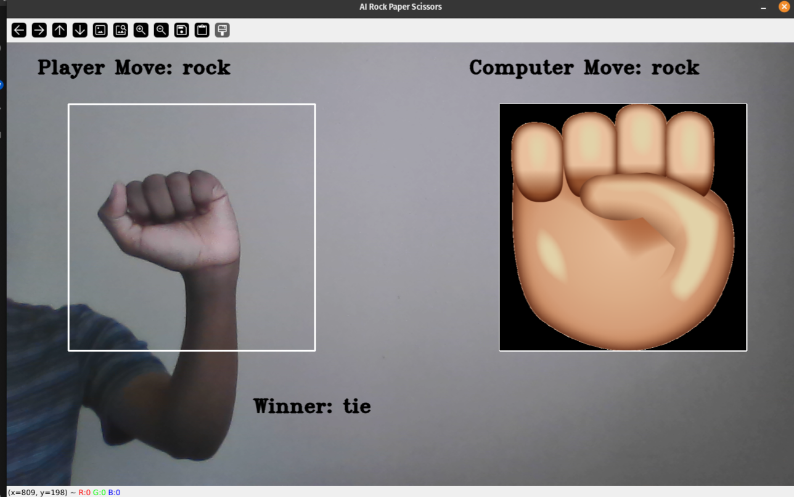
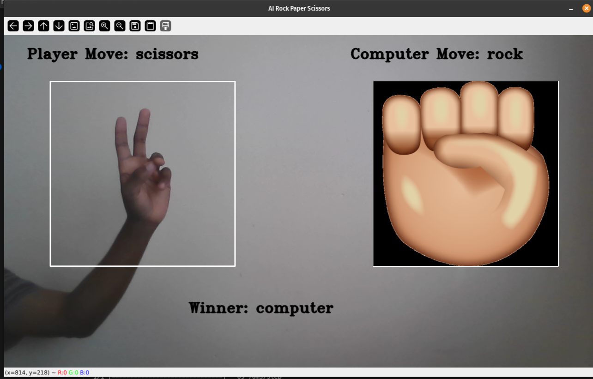
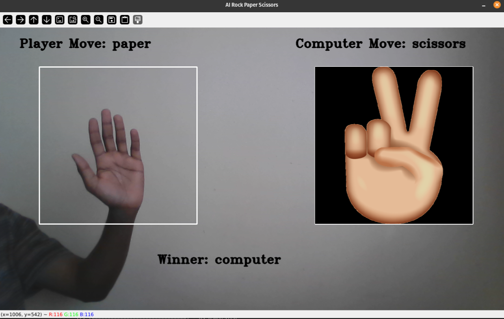
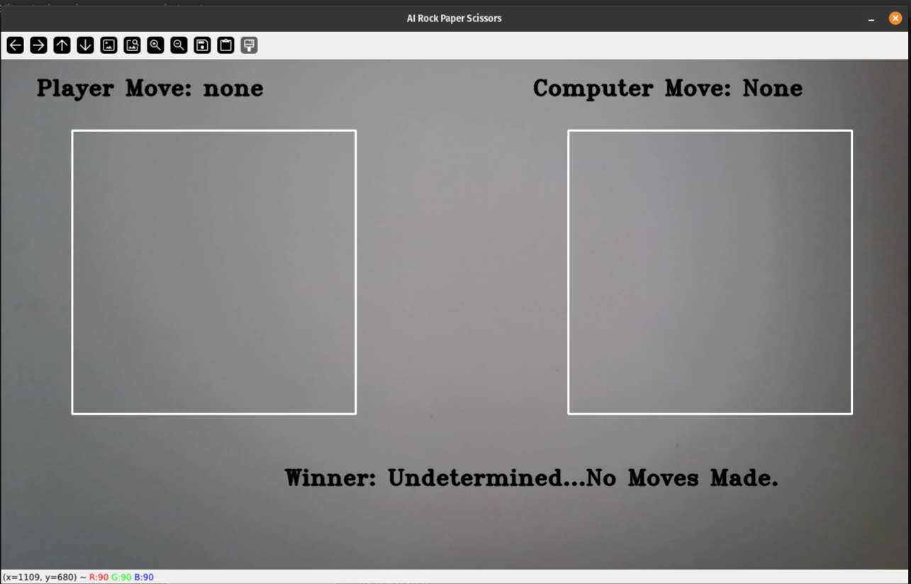
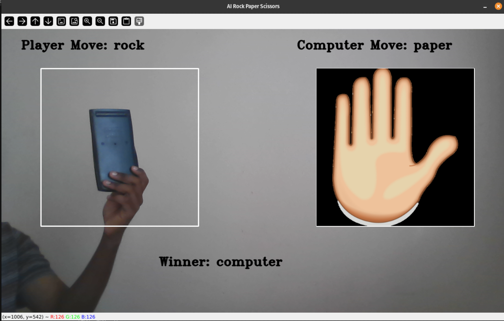
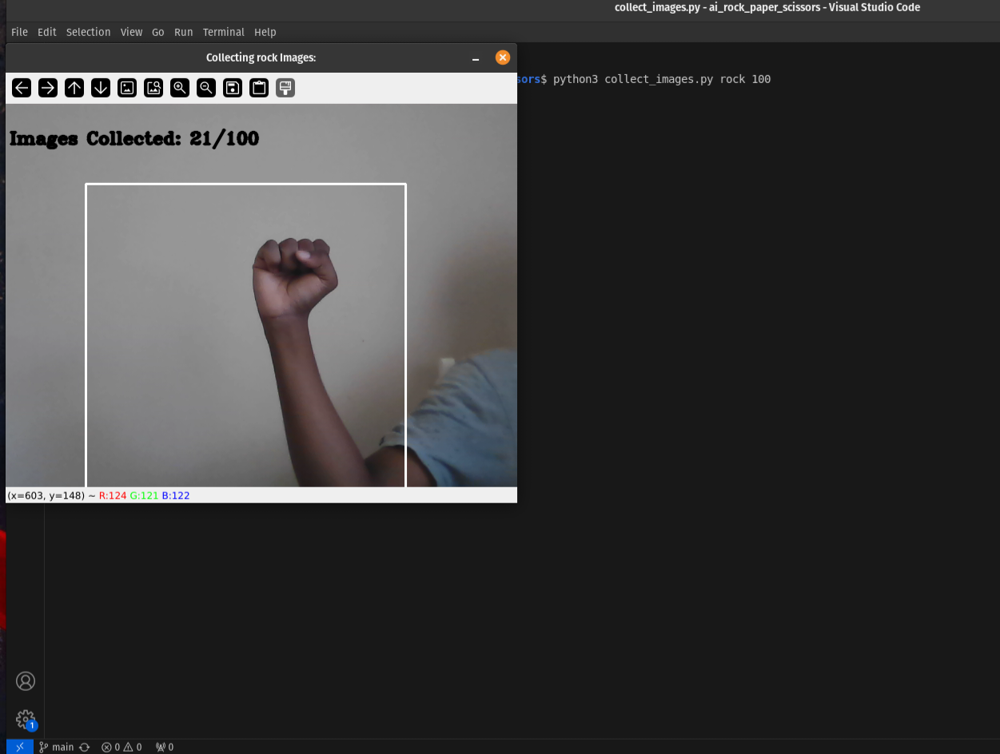
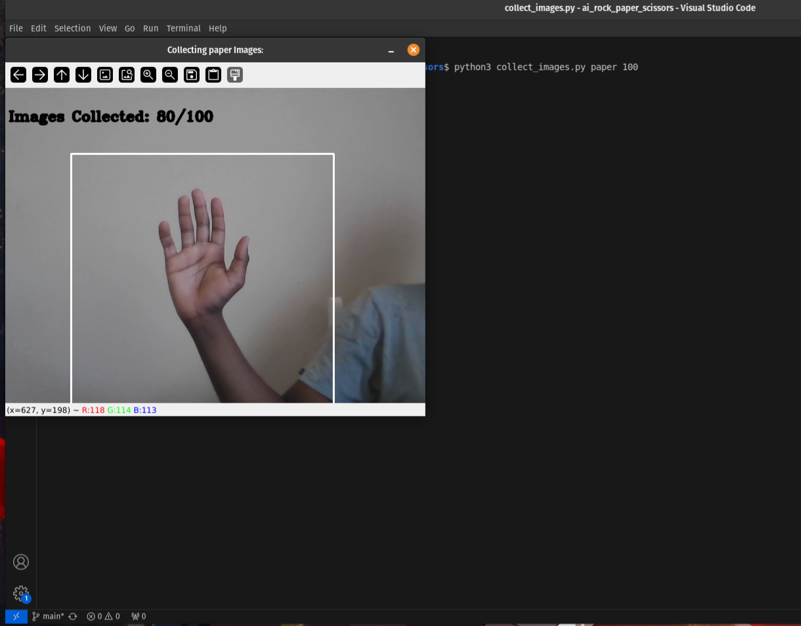
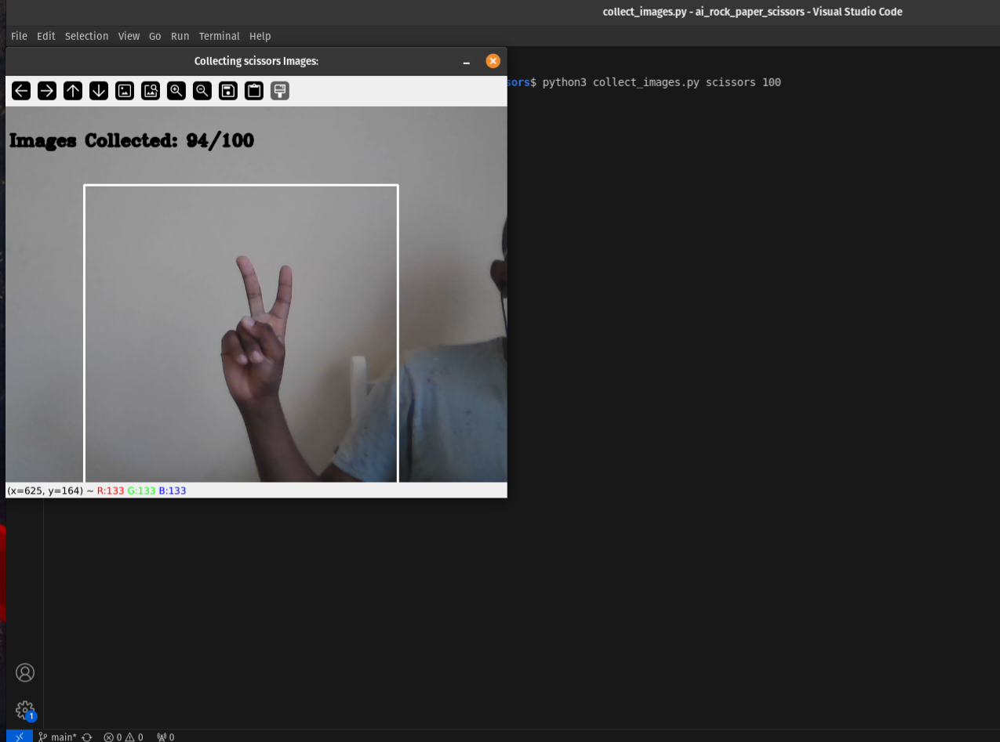
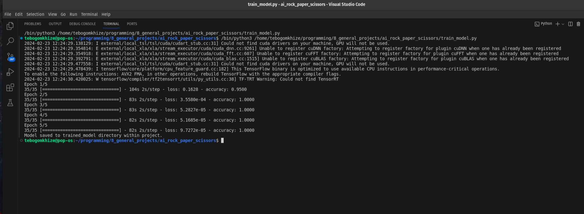

### Description/Features:
##
* AI Rock-Paper-Scissors uses a Machine Learning Model (with a DenseNet121 Base Model) for Image classification (Rock/Paper/Scissors/None). User plays against the computer's randomised moves.

* Program Features: 1) Data Images Collection, 2) Train Model, 3) Run Application.
###
### Technology/Tools:
##
* Tools, Technologies Used: Python3, OpenCV (cv2), keras (Tensorflow module for ML Models), DenseNet121 (Base Model), numpy, os, sys, random and unittest.
###
### Running Application:
##
1) Collecting Images: Collect specified number of images for provided label (rock/paper/scissors/none), images will be used to train the model.
  * format: python3 collect_images.py label num_images
  * E.g. python3 collect_images.py none 100 [100 images of none will be collected].

  * Pause Image Collection: Enter/Hit computer's spacebar.
  * Stop/Quit Image Collection: Enter/Hit computer's "q" key.
  * Image Storage: Collected images will be stored in their label directory within the "image_data" directory (Created if directory doesn't exist). 
###
2) Training Model: Train model using images collected in Image Collection process and one-hot encoded labels for rock, paper, scissors. [Note: Process is CPU intensive].
  *  E.g. python3 train_model.py
  *  Saving Model: Model is saved in trained_models directory as "rock-paper-scissors.keras".
###
3) Running Program: run_application.py.
###
### Screenshots:
##
* A look at the Gameplay and the training process in action.
###

###

###

###

###
###
## Error Demonstration:
###

###
* Training ML Models is resource intensive, sadly my PC couldn't handle the entire process. I made a few changes to the number of epochs (number of training iterations), batch size used in each epoch and reduced the overall number of images for training to 70 images per label (rock, paper,scissors, none).
* Downside to Changes: Overfitting (Model gives accurate readings to data provided but struggles in generalisation), Not enough images used and distinction made in images.
###
* Hopefully your computer can handle the training process, feel free to collect the number of images, use the number of epochs and batch size that works for your resources.
  * Modify train_model() function in train_model.py: model.fit(numpy.array(images), numpy.array(labels), batch_size=8, epochs=5)
###
###
###
## Collecting Images:
###

###

###

###
## Training Model:
###

